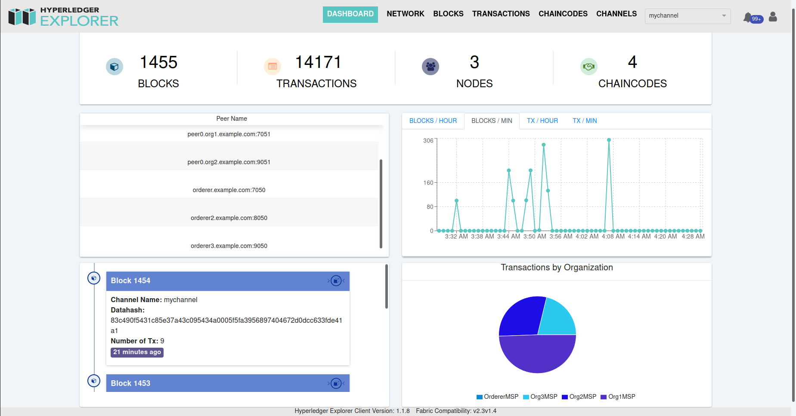

# Hyperledger Explorer

These scripts can be used to deploy the Explorer on the underlying custom fabric network for analysing the transactions and operations on the blockchain  

## Steps to deploy

1. Update the crypto-config folder with the newly created folder for the deployed fabric network. It can be found at Fabric_Network/artifacts/channel/crypto-config  
2. Update the Admin secret key in connection-profile/test-network.json from the updated crypto-config folder  
3. Deploy the explorer and explorer database nodes using provided docker compose file  
4. Now the Explorer visualization tool can be access at http://localhost:8080/  

